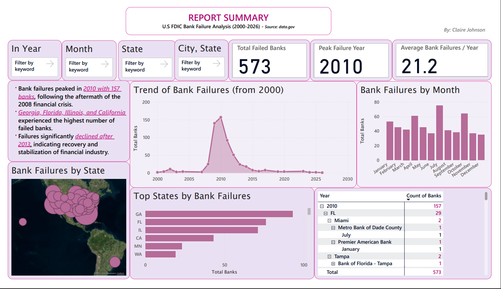

# Power BI Dashboard – U.S. Bank Failure Analysis
This project analyzes FDIC bank failure data in the United States from 2000-2026 using Power BI.
Tools: Power BI | DAX | Data Modeling | Data Visualization

## Key Insights
- Bank failures peaked in 2010 with 157 failures following the 2008 financial crisis
- Georgia, Florida, Illinois, and California experienced the highest number of failures
- Failures declined significantly after 2013 as the financial sector stabilized

## Tools Used
- Power BI
- DAX
- Data Visualization
- Data Modeling
- Data Preparation
- Business Intelligence
- Data Analytics
- Reporting
- Microsoft Power Query

## Dashboard Preview

Power BI dashboard analyzing FDIC bank failure data (2000–2026)
